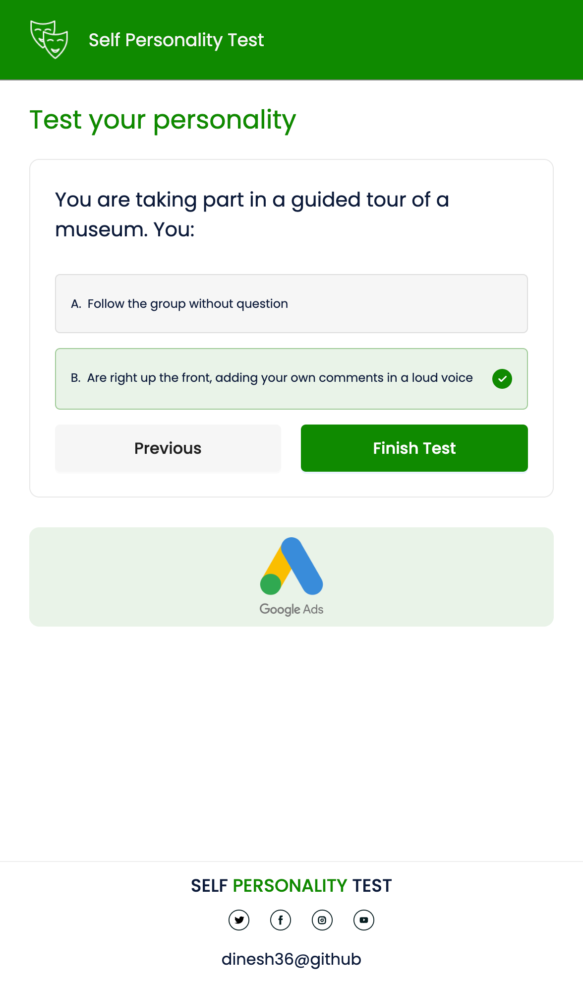

# Personality Test

## run application locally

```bash
npm run dev
# or
yarn dev
```
Open [http://localhost:3000](http://localhost:3000) with your browser to see the result.

## Desktop Screens
### Home Page


### Test Page


### Result Page


## Tablet Screens
### Home Page


### Test Page


### Result Page


## Mobile Screens
### Home Page


### Test Page


### Result Page


